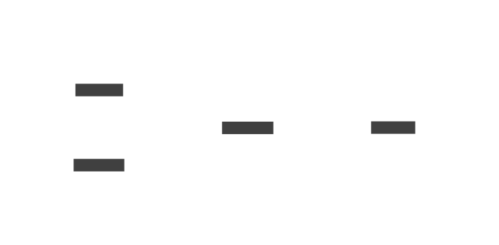

# Microtask and microtask

The term microtask makes reference to the tasks that have the highest priority.
These task are executed in the Microtask Queue before the Task Queue o Macrotask Queue.

The microtasks in Node.js are:

- Promises like:
  - Promise.then
  - catch
  - finally
- process.nextTick
- queueMicrotask()

The Macrotask in Node.js are:

- Timers:
  - setTimeout
  - setInterval
  - setImmediate
- Read and write files
- Request like HTTP and websockets
- DB queries
- events like the 'events' library
- Streams
- system API

The image below shows how this works:
The event loop push all functions in the Microtask stack to the callstack once the microtask stack is empty the event loop will start to push all functions in the macrotask stack to the callstack.



To see this in action go to this file: [micro-macro-task](./micro-macro-task.js)
Source of diagram:

```
direction: right
Microtask: {tooltip: Promises, process.nextTick, queueMicrotask are pushed here}
Macrotask: {tooltip: Timers, Read and write files etc. are pushed here}
Callstack: {tooltip: This is a LIFO stack}
EventLoop: {tooltip: The event loop is a component of the JavaScript engine that manages the execution of code}

EventLoop.shape: circle

Microtask -> EventLoop: {
  style.animated: true
}
Macrotask -> EventLoop: {
  style.animated: true
}
EventLoop -> Callstack: {
  style.animated: true
}
```
